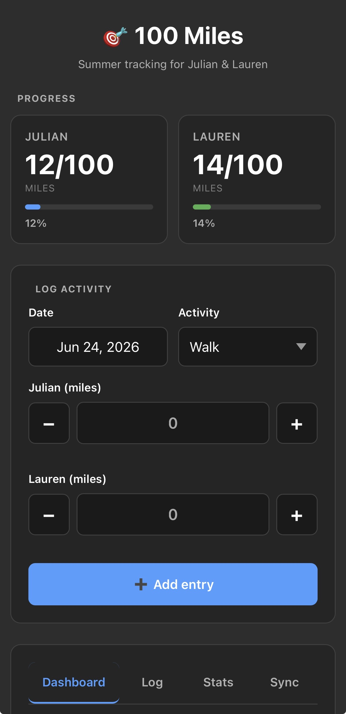
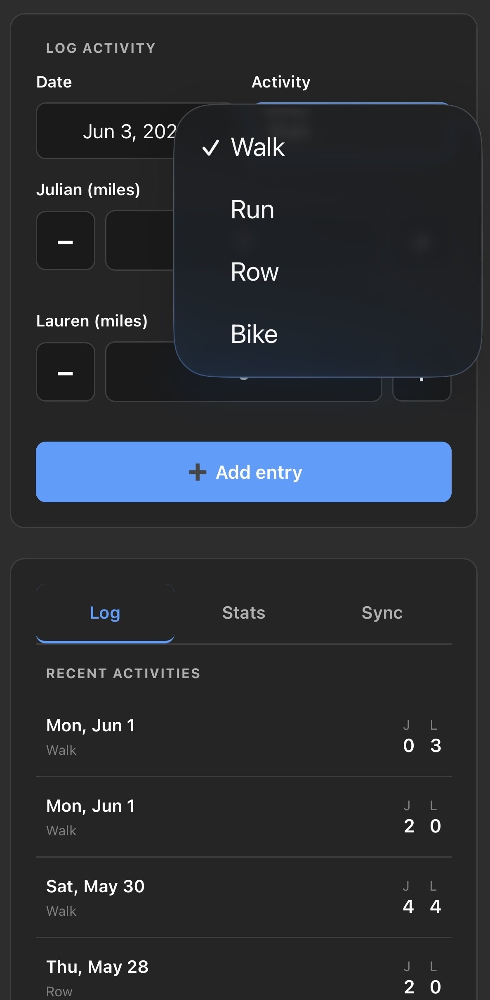

# 100 Miles of Summer

A mobile-friendly single-page web app for tracking fitness goals: 100 miles each for up to 4 people.

## Screenshots

<table>
  <tr>
    <td align="center"><strong>Progress & Logger</strong></td>
    <td align="center"><strong>Activity Selector & Log</strong></td>
  </tr>
  <tr>
    <td></td>
    <td></td>
  </tr>
</table>

## Features

- **First-time setup** — onboarding screen asks how many people (1–4) and their names before starting
- **Progress dashboard** — side-by-side cards showing each person's mile count and progress bar toward 100
- **Dashboard tab** — activity overview showing active days, inactive days, and % active for each person (calculated from configured summer start date)
- **Customizable activity types** — defaults to Walk, Run, Row, Bike; add up to 8 total, rename, or remove from Settings
- **Activity logging** — log entries with a date picker and +/− mile buttons (increments of 0.5); activity dropdown updates dynamically from configured types
- **Activity log** — chronological list of all entries with edit and delete buttons, showing date, activity type, and miles per person
- **Stats tab** — individual progress bars per person showing miles toward 100 goal, with activity breakdown by color (colors auto-assigned from palette)
- **Settings** — edit names, add/remove people (up to 4), customize activity types (up to 8), clear data with styled confirmation modal
- **Data sync** — export data as JSON for backup (includes config and entries), import from a saved file, or clear all data
- **Dark/light mode** — automatically follows system preference
- **Mobile web app** — works as an installable PWA on iOS/Android (add to home screen)

## Configuration

### First-Time Setup

On first launch, the app shows a setup screen:
1. Choose how many people to track (1–4)
2. Enter each person's name
3. Optionally set a summer start date
4. Tap **Start Tracking**

### Settings (Sync tab)

- **People** — edit names, add new people (up to 4), or remove people. Adding a person auto-adds them to all existing entries with 0 miles. Removing a person deletes their data from all entries.
- **Activity Types** — edit, add (up to 8), or remove activity types. Each type gets an auto-assigned color shown as a swatch. Renaming an activity updates all existing entries. Removing an activity hides it from the dropdown but keeps existing entries.
- **Summer Start Date** — set via a date picker (format: YYYY-MM-DD). Used to calculate total active/inactive days on the Dashboard.
- **Clear all data** — styled warning modal confirms before wiping all entries (config is preserved).

### Data Structure

```json
{
  "config": { "people": ["Julian", "Lauren"], "activityTypes": ["Walk", "Run", "Row", "Bike"], "summerStartDate": "2026-05-28" },
  "entries": [
    { "date": "2026-06-23", "miles": { "Julian": 2, "Lauren": 3 }, "activity": "Walk" }
  ]
}
```

Miles use an object keyed by name (not an array), so adding/removing people at any time is seamless.

## Usage

Open `100-miles-tracker.html` directly in any modern browser — no server or build step required.

To use across multiple devices, export your data from the **Sync** tab and save the JSON file to Google Drive or email it to yourself, then import it on the other device.

### Logging an activity

1. Set the date (defaults to today)
2. Choose an activity type from configured types (defaults: Walk, Run, Row, Bike)
3. Use the **+** / **−** buttons to set miles for each person
4. Tap **Add entry**

The progress bars update instantly in both the Dashboard and Stats tabs.

### Data persistence

Data is saved to `localStorage` in the browser. It persists across sessions on the same device and browser. Use **Export** to back up or transfer data. Exports include both the config (names) and all entries.

### Data migration

If you have data from the old format (hardcoded `julian`/`lauren` keys), the app automatically migrates it to the new object-based format on load.

## Tech

- Vanilla HTML/CSS/JS — no framework, no build tools
- Custom stacked progress bars for per-person activity breakdown
- Dynamic calculations for active/inactive days based on configurable start date
- `localStorage` for persistence
